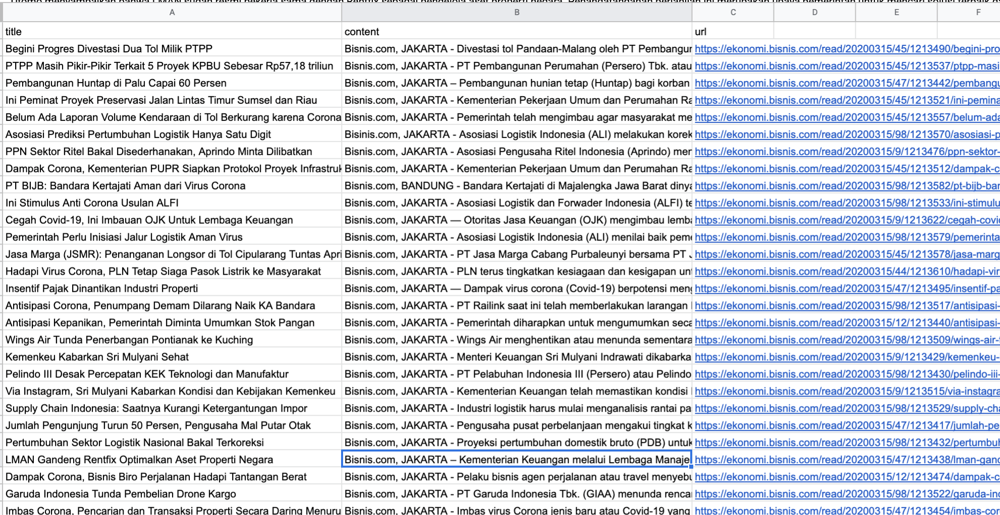

# scrap_bisnis.com
script for news scraping in bisnis.com using python

# Project Title
SCRAPING BERITA DI WEB https://www.bisnis.com/index/ MENGGUNAKAN BS4

## Getting Started
Scraping article from bisnis.com using BeautifulSoup

* Script to run
    ```
    python scraping_bisniscom.py -sd 2020-03-15 -ed 2020-03-20 -c 43
    ```
    * sd : start date with format YYYY-MM-DD
    * fo : end date with format YYYY-MM-DD
    * c : category channel code in website  

Parameters:
* start date
* end date
* channel (category channel on the web) 
  * for the channel you can see as below : 
    * 43 : Ekonomi & Bisnis
    * 194 : Market
    * 5 : Finansial
    * 197 : Life&Style 
  * If want to check in web follow this image:
    * 

The result is in .csv file and it will be look like 
